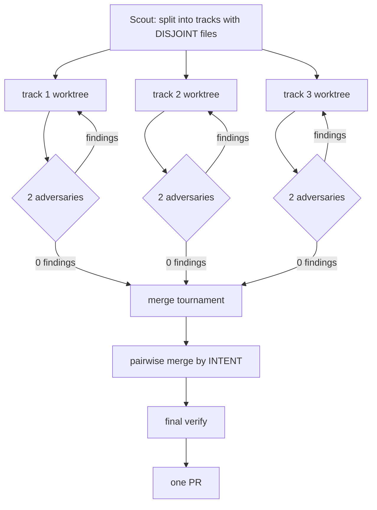

# Slyng — AI Collaboration Guide

This file (`AI.md`) is the single source of truth for AI coding agents working on slyng; the agent-specific configuration files (`CLAUDE.md`, `GEMINI.md`, `AGENTS.md`, `.cursorrules`) are symlinks to it — update it here and every tool sees the change.

---

## Project

Federated real-time chat on the **syr platform**. Users authenticate via their syr instance; identity is DID-based; profile data lives on each user's home syr instance and is fetched over federation (never stored locally). Moderation, roles, channels, messages, voice — everything Discord does, but peer-to-peer on the identity layer.

## Monorepo

| Path | Role |
|---|---|
| `apps/slyng/web` | SvelteKit SPA (adapter-static). **No SSR, no server files — pure client.** |
| `apps/slyng/native` | Tauri 2 + SvelteKit shell. Same SPA, runtime-configurable API host (`@tauri-apps/plugin-store`), first-run setup screen at `/setup`. |
| `apps/slyng/api` | NestJS API + WS gateway. |
| `packages/ts/types` | Zod v4 schemas + shared constants. Dual CJS/ESM build via tsup so `RecordId` class identity survives across the ESM/CJS boundary. |
| `packages/ts/ui` | shadcn-svelte / bits-ui components as `@slyng/ui`. Primitives in `components/ui/`; cross-app composed components in `components/fragments/` (e.g. `swipe-layout`). |
| `packages/ts/app-core` | Runtime-configurable API host helpers (`@slyng/app-core/host`). Future home for shared API client / WS / stores extracted from the web app. |

## Stack

- **Frontend**: Svelte 5 (runes only — `$state`, `$derived`, `$effect`; **no legacy writable/readable stores**), SvelteKit 2, Tailwind 4, shadcn-svelte.
- **Backend**: NestJS 11, `@nestjs/platform-ws`, SurrealDB via schemaless tables + repository pattern.
- **Validation**: Zod v4 everywhere; schemas live in `@slyng/types`.
- **Federation**: syr `.well-known/syr/<did>` manifest → profile / stories / emojis / GIFs / `public_hash` endpoints. Fetches always go through `proxied()` (see below).
- **Media**: MinIO (S3-compatible) for uploads, presign → PUT → finalize. Provider-switched via `S3_PROVIDER` (`minio` | `seaweedfs`); `ObjectStoreService` (`apps/slyng/api/src/storage/`) owns the clients + boot-time bucket/public-read-policy setup. Mirrors syr's `object-store.ts`.
- **Voice**: WebRTC mesh. Gateway is a signaling relay only.

## Commands

```bash
pnpm dev          # everything in dev mode (turbo)
pnpm dev:slyng    # the chat stack only
pnpm build        # build all packages + apps
pnpm check        # type-check all workspaces (svelte-check + tsc)
pnpm lint
pnpm format
docker compose up -d   # SurrealDB + MinIO on dev ports
```

Always run `pnpm --filter @slyng/types build` after editing `packages/ts/types/` before building api/app.

---

## Working Rules — non-negotiable

### 1. Every mutation is reactive end-to-end

A backend write has no business existing without a WS broadcast, and client stores subscribe + patch. If you add a new mutation, you must:

1. Emit the right WS event from the service (`emitToServer` / `emitToChannel` via `ChatGateway`).
2. Make sure there's a client-side `onWsEvent(...)` listener in the relevant store.
3. Wire the store into the UI via `$derived` or `$state` getters so the component re-renders automatically.

Never expect a page reload. Never rely on "the user will refresh."

### 2. Everything server-side mutation is permission-guarded at the route

Authentication is `AuthGuard`. Server-membership + ban check is `ServerAccessGuard`. Fine-grained permissions are the **`@RequirePermission('FLAG_NAME')`** decorator + `PermissionGuard`. All three are registered as `APP_GUARD` in `AuthModule`.

- **Permission checks live on the route, not in the service.** One decorator = one place to audit. `roleService.requirePermission(...)` inline calls are deprecated; remove them when you touch the file.
- `@SkipServerAccess()` opts an endpoint out of the membership guard (only for pre-membership flows like invite preview / join).
- Mixed-identity endpoints (message-delete own-vs-others, invite-delete creator-bypass) keep a narrow service-level check on top of the decorator.
- **Never skip the guard.** Every new server-scoped endpoint must have either `@RequirePermission(...)` or `@SkipServerAccess()` on it.

### 3. Every CRUD mutation audits itself

`AuditLogService.record({ serverId, actorId, action, targetKind, targetId, targetUserId?, metadata? })` — single write point. Hook it at the end of every service mutation: role CRUD, channel CRUD, server update, invite create/delete, member kick/ban/unban/role ±, message delete/purge. `record()` is fire-and-forget — failure logs, doesn't throw.

Actions surface in the audit-log page + moderation sheet via `AUDIT_LOG_APPEND` WS op. If you add a new mutation category, add it to `AuditActionSchema` and the `AuditEventRow` label map.

### 4. Soft-delete content; hard-delete ephemeral state

- Messages: `deleted: true` + `deleted_at` + `deleted_by`. Masked for readers without `VIEW_REMOVED_MESSAGES`. Purge uses `UPDATE ... SET deleted = true RETURN BEFORE`, never `DELETE FROM`.
- Bans: soft — `active: false` + `unbanned_at` + `unbanned_by`. History preserved.
- Ephemeral (read state, voice presence, typing): hard-delete fine.

### 5. WebRTC stays simple and lean

- **Mesh topology** — one `RTCPeerConnection` per peer. No SFU.
- **Deterministic offerer** — lex-smaller DID offers. Eliminates glare without rollback.
- **Pre-declared transceivers** — every PC creates an `audio` + `video` sendrecv transceiver at construction time. SDP m-line structure is fixed; `sender.replaceTrack(track | null)` adds/removes tracks without renegotiation. Late-joiners always see each other's streams.
- **No per-op renegotiation.** If you feel like calling `createOffer` mid-call, you've broken the pattern.
- Receiver tracks are wrapped in long-lived `MediaStream`s at PC creation. Gated dispatch via `track.onmute` / `onunmute` so consumers see `null` when no RTP is flowing.
- Evict on disconnect — `ChatGateway.handleDisconnect` must clean up voice state + WS subs on last-socket-close.

### 6. Responsive by default

- Small screens are a first-class citizen. Never trust that a row will fit — `max-w-[…ch]`, `truncate`, `whitespace-nowrap`, `overflow-hidden`. Overflow reveals via `<Tooltip>` hover card (shadcn), never a native `title` attr.
- Tables use `<PaginatedTable>`. Never write ad-hoc pagination — extend the shared component.
- Mobile hover ≈ no-op: any affordance discoverable only on hover must also be reachable on tap. Check the moderation sheet pattern.

### 7. Privacy: federated media proxy

Every client-side fetch or render of a remote asset (avatar, banner, profile JSON, stories, emojis, GIFs, message attachments, embed thumbnails) goes through `proxied(url)` from `$lib/utils/proxy`. The only exceptions are:
- `syr-upload-picker.svelte` (fetches the user's own syr with their cookie)
- user-initiated outbound `<SafeLink>` clicks (opt-in external navigation)
- backend `ProfileWatcher` polls (server-side; no browser)

The proxy is auth-gated (`slyng_session` cookie), 100 MB cap, SSRF guard. Oversize assets render a "Load directly" opt-in via `<SafeMedia>` — the user explicitly consents to the IP leak.

### 8. Profile data is never stored

Identity table holds DID + `syr_instance_url` only. Everything else (display_name, avatar_url, banner_url, stories, emojis) is resolved from the user's syr manifest and cached reactively in `profiles.svelte.ts` / `stories.svelte.ts` / `emojis.svelte.ts`. `PROFILE_UPDATE` WS events invalidate caches.

If you're tempted to add a column to the user table for a profile field, don't.

### 8a. API host is runtime-configurable

Never hardcode `/api` or `window.location.origin` in client code. Use `apiUrl(path)` and `wsOrigin()` from `@slyng/app-core/host`. The web app calls `setHost('')` (same-origin) in its root `+layout.ts`; the native app calls `setHost(<user-chosen URL>)` after reading from Tauri's store. Every `fetch()` against the slyng API passes `credentials: 'include'` so cookies flow cross-origin from the Tauri webview.

When adding shared cross-app components (used by both web and native), put them in `packages/ts/ui/src/lib/components/fragments/<name>/` and add a corresponding `./fragments/<name>` subpath export in `packages/ts/ui/package.json`. Stick to UI-level components there — non-UI logic (stores, api/ws clients) belongs in `@slyng/app-core`.

### 9. Copy syr patterns rather than reinvent

When a pattern exists in syr (BaseRepository, manifest resolution, federation plumbing, RecordId handling), mirror it. Do not write raw SurrealQL when `BaseRepository.findPage` / `findMany` / `count` covers it.

### 10. Shared pagination primitive

Any list that could ever grow beyond a screen uses `BaseRepository.findPage()` on the backend and `<PaginatedTable>` on the frontend. Both support sort, search (SurrealDB `string::lowercase(field) CONTAINS $q`), offset, limit. Do not fan out N queries from the client for pagination.

### 11. Reactive collections need the reactive containers

- `$state(new Set())` is **not** reactive on `.add()` / `.delete()`. Use `SvelteSet` from `svelte/reactivity`.
- Same for `Map` → `SvelteMap`.
- Plain objects + arrays are deeply reactive under `$state`; Sets and Maps are not.

### 12. NestJS idioms only

- Use `Logger` from `@nestjs/common`, not `console.log`.
- Use `ConfigModule`/`ConfigService` for env, not `process.env` directly.
- Repositories extend `BaseRepository` from `src/db/base.repository.ts`. No direct `db.query(...)` outside services.
- Controllers own validation + HTTP concerns. Services own business logic.

### 13. Don't ship broken features

No `prompt()`, no `confirm()`, no `alert()`. No `// TODO: implement later`. No half-wired buttons. No stubs. If the feature can't work, don't add the button.

### 14. Types build order

`types` → `api` / `app`. Any schema change requires `pnpm --filter @slyng/types build` before the consumer build succeeds. Remember: `@slyng/types` is dual-published (CJS + ESM) so NestJS CJS and SvelteKit ESM share the same `RecordId` class identity — `instanceof` checks work across the boundary. Don't break this.

### 15. No secrets in commits

`.env.example` shows the shape. Real `.env.local` / `.env` stays untracked. If you touch env handling, update `.env.example` + `README.md`.

---

## Compound tasks — the parallel worktree tournament

For a prompt that carries several independent fixes or features at once ("do all of these"), don't do them serially in one branch. Fan out, review adversarially, then merge by intent.



**Foundation wave first, before anyone forks.** Some files every track touches: `packages/ts/types/src/index.ts`, the schema string in `db.service.ts`, the purge lists, this file. Fork before those settle and every branch edits the same lines — exactly the conflict the split was meant to avoid. Land shared vocabulary as **one agent, no parallelism**, merged before any worktree exists. Additive by default: existing rows must parse unchanged, and a new field on an existing entity is `.optional()`, never `.default()` (a default makes it required on the inferred output type and breaks every construction site).

**Split by files, not by topic.** Tracks must own disjoint files or the merge becomes the whole job. Sharing one generated file is fine — see below. Sharing a hand-written file is not. Give each track an **explicit file territory** and say what happens at the boundary: out-of-territory problems get reported in the hand-off, never fixed. Where two tracks must touch one file, split it by function and name the exact lines each owns.

**Scout before you fan out.** Prove the build recipe yourself first — three agents discovering the same environment gotcha is three times the cost and they may each "fix" it differently. A fresh worktree here has no `node_modules` and no built `dist/`, so the API typecheck fails on unresolvable `@slyng/*` types before the agent writes a line, and rebuilding `idp-crypto` means wasm-pack and a Rust toolchain. Seed the built dists from your main checkout and verify a clean baseline `tsc` **before** launching the agent:

```bash
MAIN_CHECKOUT=/absolute/path/to/your/main/checkout   # replace: the worktree you already build in

git worktree add -b track/<name> ../.slyng-worktrees/<name> <integration-branch>
cd ../.slyng-worktrees/<name>
pnpm install --frozen-lockfile --prefer-offline

# dist/ is gitignored, so it does not come across with the worktree. Copy each
# package's dist to its OWN destination — `cp -R src/*/dist dest/*/` expands
# both globs and merges every source into the last destination directory.
for pkg in "$MAIN_CHECKOUT"/packages/ts/*/dist; do
  name=$(basename "$(dirname "$pkg")")
  [ -d "packages/ts/$name" ] && cp -R "$pkg" "packages/ts/$name/dist"
done

pnpm --filter @slyng/types build
pnpm --filter @slyng/api exec tsc --noEmit -p tsconfig.json   # must be 0 before you start
```

Skip the copy and you get a wall of phantom `TS2307`s that have nothing to do with the task.

**Two adversaries per track, with different lenses.** Technical (does it compile, does it hold, does the generated output match its source, edge cases, compiles-but-wrong) and vision (is this the right change at the right level for this codebase — rule compliance, layering, over-engineering, comment truth, scope discipline, and does every real user flow still work). Redundant reviewers find redundant bugs. The vision lens is the one that catches "the schema is beautiful and it broke leaving a voice call."

Both must be told to REFUTE, and both must be told **a clean verdict is an acceptable outcome** — an adversary that believes it is judged on findings invents them. And an adversary must **rebuild the implementer's proof itself**: a differential harness written by the author of the change proves nothing about the author's blind spot, so the review only counts when the oracle was derived independently.

**Loop to zero findings, but cap the rounds** and surface what's still open. Findings go back to the implementing agent, which fixes or rejects each **with a reason**, then both adversaries re-review. A track that exits at the cap with findings outstanding must say so — silently dropping them defeats the point.

**If an adversary refutes a track's premise, drop the track — do not patch it.** A change whose justification turned out to be false is not salvageable by rewriting its comment; shipping it leaves churn plus a docstring that installs a false belief in the next reader. Killing a track is a successful round.

**Verify the findings yourself before acting on them.** Adversaries produce stale and overstated findings. In the WS-contract run, of two findings left open at the cap, one was already fixed by a later merge and the other was real but far narrower than claimed. Fixing the first would have been wasted work; trusting the summary would have shipped the second.

**Merge by intent, not by text.** When two branches come back clean they pair up: a merge agent takes both diffs **plus each branch's stated intent** — what it changed about the product, what it changed about the code, what it deliberately did not change — and produces one branch. Winners keep pairing until one remains. Deterministic rules beat judgement where they exist: machine-generated files (`packages/ts/types/src/generated.ts`) are never hand-merged — take either side, re-run `pnpm gen`, commit the result. That single rule is what makes tracks sharing a generated file tractable.

**Check the merged result, not just the parts.** Two individually-clean diffs can typecheck apart and not together, so the repo checks run on the final branch. Then rebuild and restart the dev containers so the work can be reviewed running live.

**Agents don't push.** No `git push`, no `gh`, no PR edits from a subagent. The final diff gets read by one accountable reviewer before anything leaves the machine.

---

## Architecture cheat sheet

### Auth guard stack (request order)

```
AuthGuard            → validates `slyng_session` cookie, attaches req.user
ServerAccessGuard    → 403 if banned or non-member (resolves serverId from :serverId / :channelId / :roleId)
PermissionGuard      → reads @RequirePermission('FLAG') + RoleService.hasPermission
[ route handler ]
```

Skip with `@Public()` (pre-auth) or `@SkipServerAccess()` (authed but pre-membership).

### WS opcodes (additions go in `packages/ts/types/src/ws.ts`)

- 1–7 client→server (IDENTIFY, HEARTBEAT, SUBSCRIBE, UNSUBSCRIBE, TYPING_START, PRESENCE_UPDATE, VOICE_STATE_UPDATE)
- 10–44 server→client broadcasts — MESSAGE_*, CHANNEL_*, ROLE_*, MEMBER_*, SERVER_*, PIN_*, REACTION_*, AUDIT_LOG_APPEND
- 100–102 WebRTC signal relay (offer / answer / ICE)

### Subscription scoping

Clients subscribe to the current server's topic + every channel topic on `loadServer`. Leave → unsubscribe all. Victim of kick/ban → server-side eviction removes their subs immediately. Guard: users who aren't members get their `SUBSCRIBE` silently dropped.

---

## DON'T

- Don't add `any` — resolve the type or leave a typed unknown with a narrow cast at the boundary.
- Don't use legacy Svelte stores (`writable`/`readable`) — use runes.
- Don't reach for a tool that already exists — grep the codebase first.
- Don't skip error toasts — every async action that can fail calls `toast.error(...)`.
- Don't log secrets (session tokens, DIDs of third parties beyond necessary, WebRTC SDPs in full).
- Don't write docs / planning files / summaries unprompted — user's convention: work from conversation context.

---

## When stuck

Read `.claude/plans/shimmering-prancing-walrus.md` — the running design doc. It's block-by-block history of what was built and why. Most patterns here come from lessons there.
